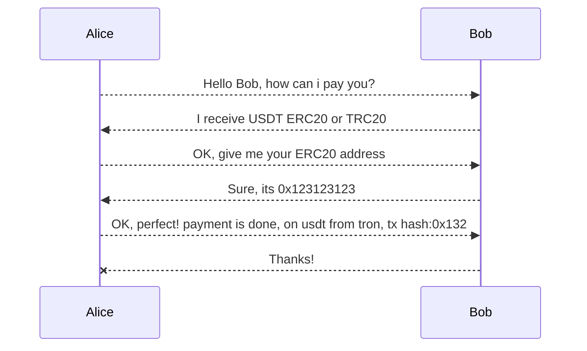
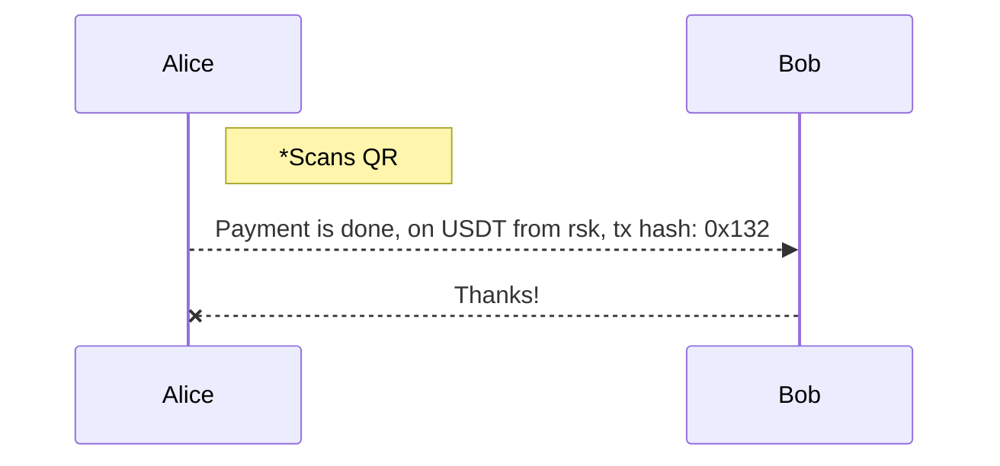

# MCRS

A multi-chain reception standard, enabling users to generate a QR or URI specifying the coins and networks they want to receive.

This standard is created to omit the handshake of users when according coins and networks to receive/send.
This way a much faster and less error prone funds reception is achieved.
Generating a (printed) QR code for the resulting URI is one the fastest and safer way to receive funds.

## Potencial use

The main idea is that userA shares its QR code or sends an URI, and userB receiving it, should be able to know what coins on which networks userA wants to receive. This handshake was previously done by communicating and agreeing on which coin to transfer through which network.
The best use case scenario would be that, when userB has all this information, can choose in which coin and network to pay, depending on wallet balance and on network costs.

### QR Generation
The purpose of this URI is to be easily generable and shareable, so the wallet software should handle the generation and shareability of this link.
The receiver can always have this unique generated QR code (containing the link) exposed to any sender for them to transfer any asset.

This use case is specially useful for merchants who need faster interactions with their customers.

This standard doesn`t describe any specific way in which this link should be used, but it´s creation was heavily influenced by the need of crypto p2p payments adoption, in a context where a lot of CEX and fintechs are already being used for this kind of micropayments.

VS

                            
## Technical aspects

### URI format

  **Scheme**
The resulting uri has its own scheme for wallets to implement.

*scheme*: `paycrypto`

Eg (URIs starting with): 
- `paycrypto://......`

**Amount**

The amount is optional and its the first part of the uri after the scheme.

>`amnt=<amount>:<currency>`
  
The amount must be a number greater than 0 with a maximum precision of 18 decimals.
The currency is an specific ticker, case insensitive, from the currencies tickers defined below.

Eg: 
- `amnt=400:USD`
- `amnt=0.0001:btc`

**Reception paths**
  
The reception paths are the possible destinations where the receiver wants to have its coins transferred.
At least 1 reception path must be specified.
  
These paths are composed by: 
  - Either an address or an alias
  - A list of possible coin tickers for the sender to pick.

>`{adr=<address>&coin=<coinList>}` or 
`{alias=<alias>&coin=<coinList>}`

Eg:
- `{adr=0x295e26495CEF6F69dFA69911d9D8e4F3bBadB89B&coin=dai:eth,dai:matic,dai:rsk}`
- `{alias=juampiq6.eth&coin=eth:eth}`
- `{adr=bc1qar0srrr7xfkvy5l643lydnw9re59gtzzwf5mdq&coin=btc:btc}`
  
***Address validity***
Since this URI is generated by a wallet software, address validity for each coin on the path should be checked.

  
***Note***: when generating a QR code with the full URI, number of paths should be less than X for better QR Code operability.

---

### Example URIs

- User wants to receive USDT,USDC or DAI on ETH, RSK, MATIC or BSC:
    
      paycrypto://amnt=400:USD{adr=0x295e26495CEF6F69dFA69911d9D8e4F3bBadB89B&coin=usdt:eth,usdt:matic,usdt:rsk}{adr=bc1qar0srrr7xfkvy5l643lydnw9re59gtzzwf5mdq&coin=btc:btc}{alias=juampi.eth&coin=btc:btc}

### List of fiats, coins and chains

For optimizing the size the generated URI occupies, coin, chains and fiat are defined in a nominal way, instead of by contract address or network coinType or any other numerical identifier these component can have.
A json file, `metada.json`, is defined on this repository with all these possible and valid values. 