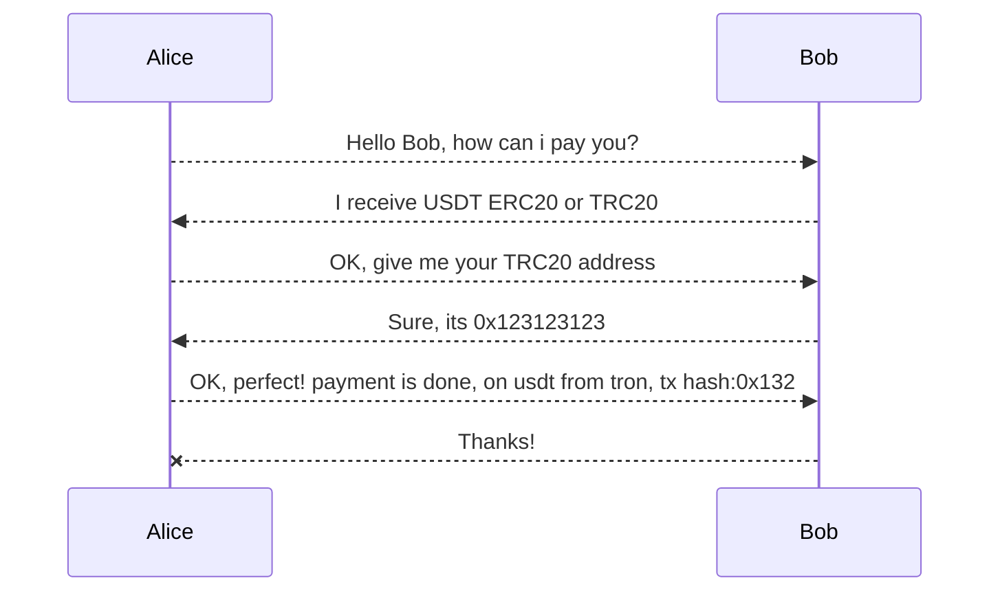
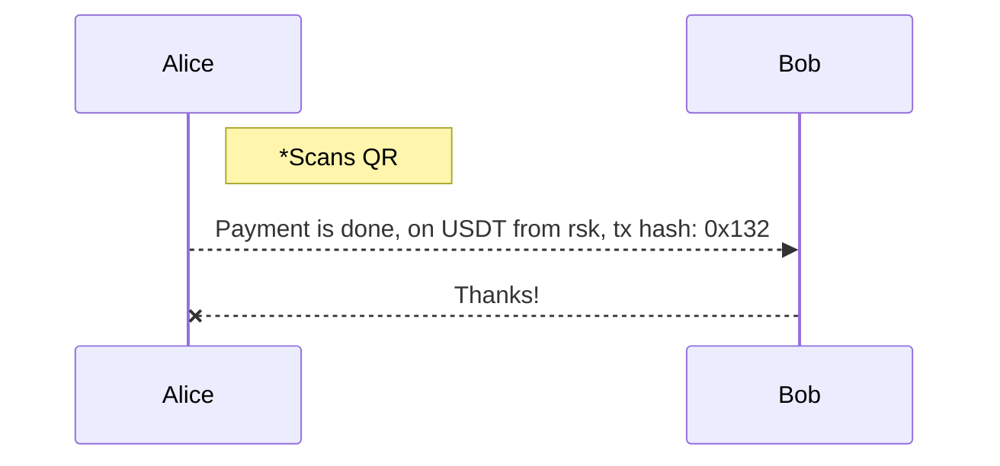

# MCRS

A multi-chain reception standard, enabling users to generate a QR or URI specifying the coins and networks they want to receive.

This standard is created to omit the handshake of users when according coins and networks to receive/send.
This way a much faster and less error prone funds reception is achieved.
Generating a (printed) QR code for the resulting URI is one the fastest and safer way to receive funds.

## Potencial use

The main idea is that userA shares its QR code or sends an URI, and userB receiving it, should be able to know what coins on which networks userA wants to receive. This handshake was previously done by communicating and agreeing on which coin to transfer through which network.
The best use case scenario would be that, when userB has all this information, can choose in which coin and network to pay, depending on wallet balance and on network costs.

VS

                            
## Technical aspects

### URI format

The resulting uri has its own scheme for wallets to implement, a domain, and as query params, all the necessary data to define desired receveing coins and adresses.
scheme: 'paycrypto'
domain: 'pay.crypto'

---

### Query params

Its composed by three main arrays, which index should be merged to form the desired possible destination.
  
  - **Coins array of array (coins[][]):**
      
      
      
      Coins are first defined by userA, following an special convention between the coin symbol (defined in paycrypto-coin-convention) and the network           symbol. This is an array of an array, since we can aggregate to receive any of the coins specified on the inner array for an specific address or           alias. Many convention coin names (separated by commas) can be specified. 
      >*Required*
      
      
  - **Addresses array (address[]) :**

      
      
      This param defines the address to send the coins specified on the first 'coins' param. 
      >*Only neccesary if **alias** is not specified*
  
  - **Alias array (alias[]):**
      
      This param defines the alias that must be searched for receveing the coins.
      Custodial wallets can take advantage of this by letting their users send money for free when possible.
      >*Only neccesary if **address** is not specified*
      
      ---

### Example URIs

- User wants to receive USDT,USDC or DAI on ETH, RSK, MATIC or BSC:
    
      paycrypto://pay.crypto/?coins=usdt-eth,usdt-matic,usdt-rsk,usdt-bsc,usdc-eth,usdc-matic,usdc-rsk,usdc-bsc,dai-eth,dai-matic,dai-rsk,dai-bsc&address=0x295e26495CEF6F69dFA69911d9D8e4F3bBadB89B

